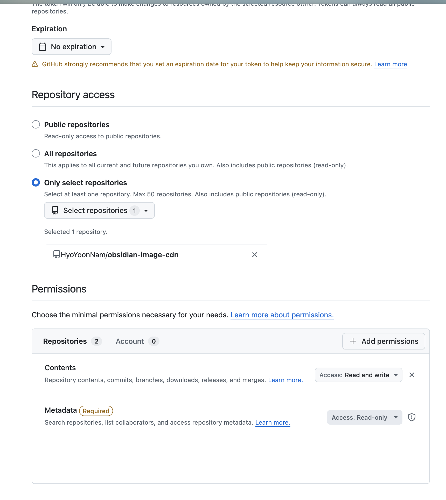

# Image Paste on GitHub

Upload pasted (or dropped) images straight to your own GitHub repository and insert
a `raw.githubusercontent.com` link instead of saving the file into your vault. Keep
your Obsidian vault small while your screenshots live on GitHub's CDN.

## Why

Unlike Notion, Obsidian stores every pasted image as a local file, so your vault
keeps growing. This plugin intercepts the paste, commits the image to a GitHub
repo you control, and embeds the public raw URL — nothing is written to your vault.

## ⚠️ Before you start

- **The target repository must be public.** Raw GitHub links only render without a
  token for public repos, so **every image you paste becomes publicly accessible.**
  Do not paste sensitive screenshots.
- Use a **fine-grained personal access token** scoped to a **single repository**
  with **Contents: read and write**, and give it an **expiration date**. Nothing
  else is needed, so a leaked token can only push to that one image repo.
- The token is stored **unencrypted** in this vault's plugin data (`data.json`).
  Do not sync, commit, or share `data.json`.

## Setup

Open Settings → Image Paste on GitHub. The settings are ordered so you choose the
repository first, then create a token scoped to it:

1. Fill in **Owner** (your username/org) and **Repository**.
2. **Create repository → Create**: makes a new public repo (and fills in owner and
   repository for you). If your token is scoped too narrowly to create repos, it
   opens GitHub's new-repo page instead. Skip this if the repo already exists.
3. **Create a token → Open GitHub**: generates a fine-grained PAT. Restrict it to
   that repository and grant **Contents: read and write**, then paste it into
   **GitHub token**.
4. Optionally adjust **Branch** (default `main`) and **Upload path** (default
   `assets`).
5. Click **Test connection** to confirm push access and public visibility.

When creating the token, restrict **Repository access** to your image repository and
set **Contents** to **Read and write** (Metadata stays Read-only):



## Usage

Paste or drag an image into any note. A `` placeholder appears,
and once the upload finishes it is replaced with ``.
If config is missing, Obsidian's default local-save behavior is left untouched.

## Development

```bash
npm install
npm run dev    # watch build
npm run build  # type-check + production bundle
```

Copy `main.js`, `manifest.json`, and `styles.css` into
`<vault>/.obsidian/plugins/image-paste-on-github/` to test.

## Security

Obsidian has no secure credential storage, so the token is kept **unencrypted** in
`data.json` — the same as other token-based plugins. The plugin only sends the token
to GitHub in the `Authorization` header; it is never written to your notes, logged,
or placed in URLs. The practical risk is `data.json` leaking through sync, backups,
or sharing, so the main protection is keeping the token narrowly scoped:

- Scope it to a **single public repository** with **Contents: read and write** only.
- Set an **expiration date** and rotate it.
- Never sync, commit, or share `data.json`.

With this setup, a leaked token can only push images to that one repo — it cannot
touch the rest of your GitHub account.

## License

MIT
